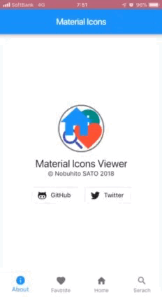

# miv


Material Icons Viewer



## How to use

```sh
git clone https://github.com/nobuhito/miv.git
cd miv
flutter build
flutter install
```

## List of App features

* Icon display by category
* Change the size of the icon display with a pinch
* List only favorite icons
* Keyword search
* History management of search keywords

## Features of Flutter used in this App

* [BottomNavigationBar](https://docs.flutter.io/flutter/material/BottomNavigationBar-class.html)
* [DefaultTabController](https://docs.flutter.io/flutter/material/DefaultTabController-class.html)
* [FutureBuilder](https://docs.flutter.io/flutter/widgets/FutureBuilder-class.html)
* [GestureDetector](https://docs.flutter.io/flutter/widgets/GestureDetector-class.html)
* [GridView.builder](https://docs.flutter.io/flutter/widgets/GridView/GridView.builder.html)
* [Hero](https://docs.flutter.io/flutter/widgets/Hero-class.html)
* [http.get](https://pub.dartlang.org/packages/http)
* [jsonDecode](https://api.dartlang.org/stable/2.1.0/dart-convert/jsonDecode.html)
* [MediaQuery](https://docs.flutter.io/flutter/widgets/MediaQuery-class.html)
* [RegExp](https://docs.flutter.io/flutter/dart-core/RegExp-class.html)
* [SharedPreferences](https://pub.dartlang.org/packages/shared_preferences)
* [TextEditingController](https://flutter.io/docs/cookbook/forms/text-field-changes)

And so on

## Library used in this App

* [flutter_svg](https://pub.dartlang.org/packages/flutter_svg)
* [http](https://pub.dartlang.org/packages/http)
* [material_design_icons_flutter](https://pub.dartlang.org/packages/material_design_icons_flutter)
* [shared_preferences](https://pub.dartlang.org/packages/shared_preferences)
* [url_launcher](https://pub.dartlang.org/packages/url_launcher)

## License

[MIT License](LICENSE)

Copyright (c) 2018 Nobuhito SATO

## Author

Nobuhito SATO [Twitter](https://twitter.com/nobuhito/)